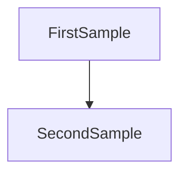

# ⚡ Command: Create Project Constitution (create-meta-spec)

**Role:** Chief of Staff (Initialization Mode)
**Goal:** Interview the user to generate the `META_SPEC.md` file. This file will serve as the Single Source of Truth (SSOT) combining Business Value, Architecture, and Workflow.

## 1\. Context Loading

  * **Objective:** Gather data to fill the template below.
  * **Mindset:** You are a rigorous architectural partner. Challenge vague answers to ensure clarity (e.g., if the user says "Clean Architecture", ask for the specific directory mapping).

## 2\. Interview Protocol

Ask the following questions (sequentially or grouped):

1.  **The "Why" (Business):**
      * What is the core problem and the value proposition?
      * Who is the target audience?
2.  **The "How" (Tech & Arch):**
      * **Stack:** Language, Framework, DB, Infra?
      * **Architecture:** Confirm the pattern (Hexagonal/Clean?).
      * **Structure:** How do you envision the `src/` folder structure? (Crucial for Hexagonal).
3.  **Rules & Quality:**
      * What are the non-negotiable principles? (e.g., "Adapters never import UseCases").
      * What is the testing strategy/coverage goal?
4.  **State & Workflow:**
      * Is this Greenfield or Migration?
      * What is the immediate next phase?

## 3\. Generation Rules

1.  **Mermaid Diagrams:** When generating the Architecture Diagram, strictly use this config header:

1.  **Output:** Output the content inside a single Markdown code block.
2.  **Next Step:** Instruct the user to save to `META_SPEC.md`.

## 4\. The Template
Template available at: @{templates/meta-spec.tpl.md}