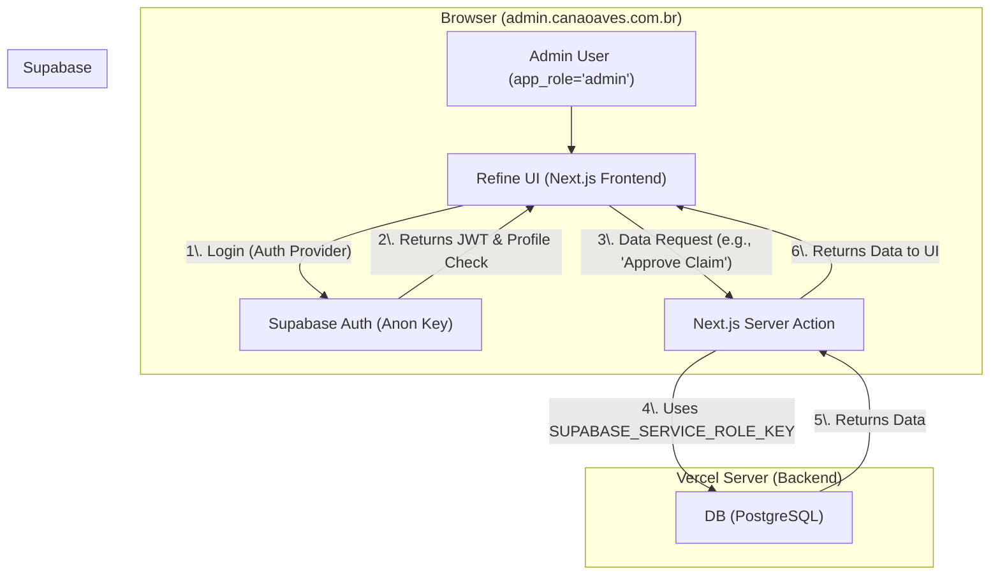

# META SPEC: canaoaves-admin

> **Status:** Living Document
> **Last Update:** 2025-11-15

## 1. Business Vision (The "Why")
* **Core Problem:** A plataforma colaborativa Canaoaves precisa de um back-office seguro para moderação de conteúdo (aprovações de envios de usuários), gerenciamento de reivindicações de propriedade e administração de usuários. Usar o Supabase Studio nativo é um risco de segurança e ineficiente para workflows de moderação.
* **Value Proposition:** Um painel de administração dedicado (`admin.canaoaves.com.br`), construído com Refine, que fornece workflows de moderação eficientes e seguros. Ele se conecta ao Supabase usando lógica *server-side* para contornar a RLS (Row Level Security) com segurança.
* **Target Audience:** Administradores e Moderadores internos da plataforma Canaoaves.

## 2. System Architecture (The "How")
* **Pattern:** Arquitetura de Recursos Server-Side (Next.js + Refine)
* **High-Level Diagram:**

* **Directory Structure Map:**
    * `.ai/`: Personas e regras de IA (como este).
    * `src/providers/`: Lógica central do Refine (ex: `authProvider`, `dataProvider`) e clientes Supabase (client-side e server-side).
    * `src/app/`: Páginas de recursos do Refine (ex: `(authenticated)/profiles/`, `(authenticated)/moderation/`) e Server Actions (`src/app/actions/`).
    * `src/components/ui/`: Componentes de UI (shadcn/ui).

## 3. Tech Stack & Tooling
* **Language:** TypeScript
* **Framework:** Next.js (v14+), Refine (v5+), React (v19)
* **Database:** Supabase (PostgreSQL)
* **Infra/DevOps:** Vercel
* **Justification:** O Refine acelera o desenvolvimento de back-office. O Next.js é **obrigatório** para a lógica server-side (Server Actions) que usa a `SUPABASE_SERVICE_ROLE_KEY` de forma segura, permitindo que o admin contorne a RLS do Supabase sem expor a chave secreta ao navegador.

## 4. Principles & Critical Rules
* **Technical Vision:** Um painel de admin seguro onde a separação entre cliente e servidor é a principal diretriz de segurança. A autenticação (client-side) é separada da autorização de dados (server-side).
* **Non-Negotiable Rules:**
    1.  A `SUPABASE_SERVICE_ROLE_KEY` **NUNCA** deve ser exposta ao cliente. Ela só pode ser usada em Server Actions ou API Routes (variáveis de ambiente do servidor).
    2.  O `authProvider` **DEVE** verificar se o `profile.app_role` é igual a `'admin'` após o login. Usuários comuns (`'user'`) devem ser deslogados imediatamente.
    3.  Todas as mutações de dados (Create, Update, Delete) **DEVEM** passar pelo `dataProvider` server-side para contornar a RLS. O cliente Supabase (anon key) só deve ser usado para autenticação.

## 5. Workflow & State
* **Current Phase:** Specification (Especificação e Planejamento).
* **Active Plan:** `.ai/memory/current_plan.md` (O plano de execução recém-criado).
* **Documentation Strategy:** `ADR/` (Architectural Decision Records) e este `META_SPEC.md` são as fontes da verdade.

## 6. Processes (Git & Quality)
* **Branching Model:** GitFlow (ex: `feature/MOD-01-claims-queue` -> `develop` -> `main`).
* **Commit Pattern:** Conventional Commits (ex: `feat(claims): cria fila de moderação`).
* **PR Policy:** Revisão obrigatória, deve passar no `lint`.
