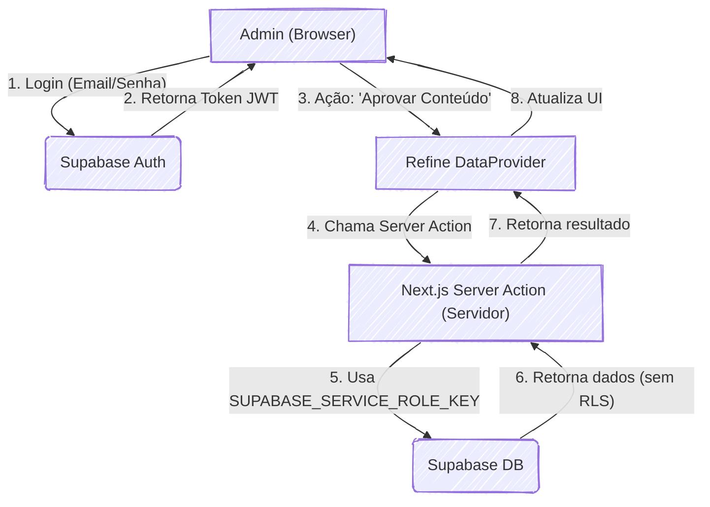

# ⚡ Admin Canaoaves

[](https://nextjs.org/)
[](https://refine.dev/)
[](https://supabase.com/)
[](https://ui.shadcn.com/)
[](https://www.typescriptlang.org/)
[](https://tailwindcss.com/)
[](https://vercel.com/)

Painel administrativo interno para o projeto **Canaoaves**, focado em moderação de conteúdo, gerenciamento de usuários e administração geral da plataforma.

Construído com **Refine** sobre **Next.js**, utilizando **Supabase** como backend e **shadcn/ui** para a interface.

### Badges da Stack

-----

## 📖 Sobre o Projeto

Este painel serve como a central de controle para a plataforma Canaoaves. Sua principal responsabilidade é fornecer uma interface segura para a equipe de administração e moderação gerenciar todos os aspectos da aplicação, contornando as regras de RLS (Row Level Security) que são aplicadas aos usuários finais.

Ele é projetado para ser uma aplicação *server-side* (usando Server Actions do Next.js) para garantir que chaves de serviço (`SERVICE_ROLE_KEY`) nunca sejam expostas ao navegador.

## ✨ Principais Funcionalidades

O escopo do projeto inclui:

  * **🔐 Gestão de Autenticação:**

      * Login exclusivo para administradores (`app_role: 'admin'`).
      * Bloqueio automático de usuários que não possuem a role de admin.

  * **🛠️ Filas de Moderação:**

      * Aprovação/Rejeição de **Reivindicações de Serviços** (`service_ownership_claims`).
      * Moderação e resolução de **Denúncias** (`reports`).
      * Aprovação/Rejeição de **Conteúdo Gerado por Usuários** (descrições de cidades/estados, imagens).

  * **🗂️ Gerenciamento de Dados (CRUD):**

      * CRUD completo de **Perfis de Usuários** (`profiles`), incluindo a capacidade de alterar a `app_role`.
      * CRUD completo de **Serviços** (`services`), permitindo edição direta pela administração.
      * CRUD de **Taxonomia** (Categorias, Comodidades, Ofertas de Serviço).

  * **📄 Gestão de Conteúdo Estático:**

      * Editor Rich Text (WYSIWYG) para gerenciar o conteúdo de páginas como "Termos de Uso" e "Política de Privacidade".

## 🏛️ Arquitetura e Acesso a Dados (RLS Bypass)

A arquitetura é o pilar deste projeto. A aplicação pública do Canaoaves usa RLS do Supabase para garantir que usuários só possam ver e editar seus próprios dados. Este painel de administração, por definição, precisa ver e editar *todos* os dados.

Para fazer isso de forma segura, implementamos a seguinte arquitetura:

1.  **Client-side (Navegador):** Usa a chave pública `NEXT_PUBLIC_SUPABASE_ANON_KEY`. É responsável apenas pela autenticação (login) e por renderizar a UI.
2.  **Server-side (Next.js):** Usa a chave secreta `SUPABASE_SERVICE_ROLE_KEY`.
3.  **Fluxo de Dados:** Todas as operações de dados do Refine (`getList`, `getOne`, `create`, `update`, `delete`) **não** chamam o Supabase diretamente. Elas são roteadas para **Next.js Server Actions**.
4.  **Server Actions:** Dentro das Server Actions, instanciamos um cliente Supabase especial (com a `SERVICE_ROLE_KEY`) que possui privilégios totais e ignora todas as regras de RLS.

Este fluxo garante que a chave de serviço (que dá acesso total ao banco) nunca saia do ambiente seguro do servidor.



## 🚀 Começando

Siga os passos abaixo para executar o projeto localmente.

### 1\. Pré-requisitos

  * Node.js (versão 20 ou superior, conforme `package.json`)
  * `npm` (ou o gerenciador de pacotes de sua escolha)
  * Acesso às chaves do projeto Supabase.

### 2\. Instalação

1.  Clone o repositório:

    ```bash
    git clone https://github.com/SEU_USUARIO/canaoaves-admin.git
    cd canaoaves-admin
    ```

2.  Instale as dependências:

    ```bash
    npm install
    ```

### 3\. Variáveis de Ambiente

Crie um arquivo `.env.local` na raiz do projeto. Você pode copiar o `.env.example` (se existir) ou criar um novo com as seguintes variáveis:

```plaintext
# URL pública do Supabase
NEXT_PUBLIC_SUPABASE_URL=https://[SEU_PROJETO].supabase.co

# Chave 'anon' (pública) do Supabase
NEXT_PUBLIC_SUPABASE_ANON_KEY=[SUA_CHAVE_ANON]

# Chave 'service_role' (secreta) do Supabase
# IMPORTANTE: NÃO adicione o prefixo NEXT_PUBLIC_
SUPABASE_SERVICE_ROLE_KEY=[SUA_CHAVE_SERVICE_ROLE]
```

### 4\. Executando Localmente

Após configurar as variáveis de ambiente, inicie o servidor de desenvolvimento:

```bash
npm run dev
```

Abra [http://localhost:3000](https://www.google.com/search?q=http://localhost:3000) no seu navegador para ver a aplicação.

## 📦 Scripts NPM

  * `npm run dev`: Inicia o servidor de desenvolvimento.
  * `npm run build`: Gera o build de produção.
  * `npm run start`: Inicia um servidor de produção (requer `npm run build` primeiro).
  * `npm run lint`: Executa o linter (ESLint) para verificar o código.

## 🌐 Deploy

O projeto está configurado para deploy contínuo (CI/CD) através da **Vercel**.

  * **Repositório:** `github.com/richtertech/canaoaves-admin`
  * **Produção:** Qualquer push ou merge para a branch `main` (ou `master`) iniciará um novo build e deploy.
  * **Domínio:** A aplicação de produção está disponível em:
    **[https://admin.canaoaves.com.br](https://admin.canaoaves.com.br)**

As variáveis de ambiente (`NEXT_PUBLIC...` e `SUPABASE_SERVICE_ROLE_KEY`) devem ser configuradas no painel do projeto na Vercel (em **Settings -\> Environment Variables**).
