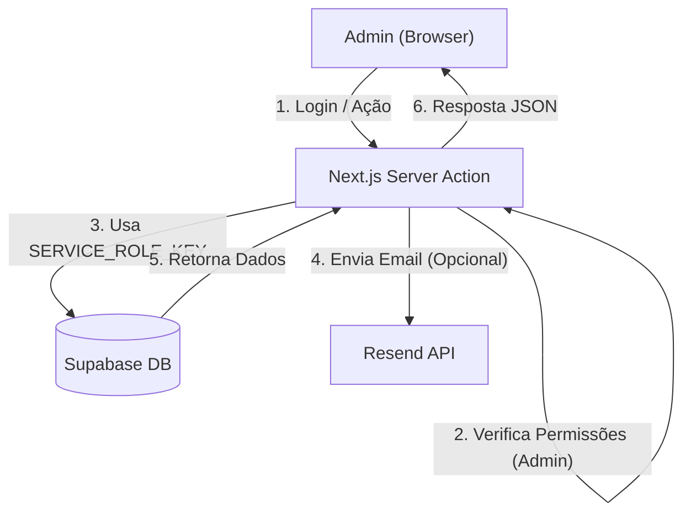

# ⚡ Admin Canaoaves

[](https://nextjs.org/)
[](https://refine.dev/)
[](https://supabase.com/)
[](https://ui.shadcn.com/)
[](https://www.typescriptlang.org/)
[](https://tailwindcss.com/)
[](https://resend.com/)
[](https://vercel.com/canaoaves-projects/canaoaves-admin)

Painel administrativo interno para o projeto **Canaoaves**, focado em moderação de conteúdo, gerenciamento de usuários, SEO local e comunicação em massa.

Construído com **Refine** sobre **Next.js**, utilizando **Supabase** como backend, **Resend** para emails transacionais/marketing e **shadcn/ui** para a interface.

-----

## 📖 Sobre o Projeto

Este painel serve como a central de controle para a plataforma Canaoaves. Sua principal responsabilidade é fornecer uma interface segura para a equipe de administração e moderação gerenciar todos os aspectos da aplicação, contornando as regras de RLS (Row Level Security) que são aplicadas aos usuários finais.

Ele é projetado para ser uma aplicação *server-side* (usando Server Actions do Next.js) para garantir que chaves de serviço (`SERVICE_ROLE_KEY`) nunca sejam expostas ao navegador.

## ✨ Principais Funcionalidades

### 🔐 Gestão de Autenticação e Usuários
*   **Login Admin:** Acesso exclusivo para usuários com `app_role: 'admin'`.
*   **Gestão de Perfis:** CRUD completo de usuários (`profiles`), com capacidade de promover/rebaixar roles.
*   **Impersonação (Login As):** Capacidade de administradores "logarem" como qualquer usuário para prestar suporte ou verificar bugs (`src/app/actions/impersonate.ts`).
*   **Trigger de Registro:** Gerenciamento automático de criação de perfil via trigger `public.handle_new_user` no Supabase.

### 📢 Comunicação e Marketing (Novo)
*   **Broadcasts (Comunicados):** Módulo dedicado para envio de emails em massa para usuários (`src/app/communications`).
*   **Segmentação:** Filtros para enviar mensagens para todos os usuários ou grupos específicos.
*   **Integração Resend:** Utiliza a API da Resend para alta entregabilidade de emails (`src/app/actions/send-broadcast.ts`).

### 🛠️ Moderação e Conteúdo
*   **Filas de Moderação:**
    *   Reivindicações de Propriedade de Serviço (`service_ownership_claims`).
    *   Denúncias (`reports`) e Comentários (`comments`).
*   **Gestão de Serviços:** Edição completa de serviços, ofertas e fotos.
*   **Taxonomia:** Gerenciamento de Categorias e Comodidades (Amenities).

### 🌍 SEO e Localização
*   **Descrições de Cidades e Estados:** Módulo para criar e aprovar textos descritivos otimizados para SEO para páginas de cidades (`cities`) e estados (`state-descriptions`).
*   **Imagens de Cidades:** Gestão de banco de imagens para capas de cidades (`city-images`).

### 📄 Conteúdo Institucional
*   **Páginas Estáticas:** Editor Rich Text para Termos de Uso, Política de Privacidade, etc (`static-content`).

## 🏛️ Arquitetura e Segurança (RLS Bypass)

A arquitetura segue o padrão **Server Action Proxy**:

1.  **Client-side:** Autenticação padrão e UI (Refine).
2.  **Server Actions:** Todas as mutações e leituras sensíveis passam por Server Actions do Next.js.
3.  **Privilégio Elevado:** As Server Actions instanciam um cliente Supabase com `SUPABASE_SERVICE_ROLE_KEY` para ignorar RLS e executar operações administrativas.



## 🚀 Começando

### 1. Pré-requisitos
*   Node.js >= 20
*   NPM

### 2. Variáveis de Ambiente
Crie um arquivo `.env.local` com as chaves abaixo. **Atenção:** A chave `RESEND_API_KEY` é crucial para o funcionamento do módulo de comunicações.

```bash
# Supabase - Conexão com o Banco de Dados
NEXT_PUBLIC_SUPABASE_URL=https://[SEU_PROJETO].supabase.co
NEXT_PUBLIC_SUPABASE_ANON_KEY=[SUA_CHAVE_ANON]
SUPABASE_SERVICE_ROLE_KEY=[SUA_CHAVE_SERVICE_ROLE_SECRETA]

# Domínio (Cookies)
NEXT_PUBLIC_COOKIE_DOMAIN="" # Vazio para localhost

# Resend (Serviço de Email)
RESEND_API_KEY=re_123456789...
```

### 3. Instalação e Execução

```bash
# Instalar dependências
npm install

# Rodar servidor de desenvolvimento
npm run dev
```

Acesse [http://localhost:3000](http://localhost:3000).

## 📦 Scripts NPM

*   `npm run dev`: Servidor de desenvolvimento.
*   `npm run build`: Build de produção (Refine + Next.js).
*   `npm run start`: Inicia servidor de produção.
*   `npm run lint`: Verificação de código.
*   `npm run gen:types`: Gera tipagem TypeScript do Supabase (`src/types/database.types.ts`).

## 🌐 Deploy

O projeto utiliza CI/CD na **Vercel**.
*   Certifique-se de configurar a variável `RESEND_API_KEY` no painel da Vercel para que o envio de emails funcione em produção.
